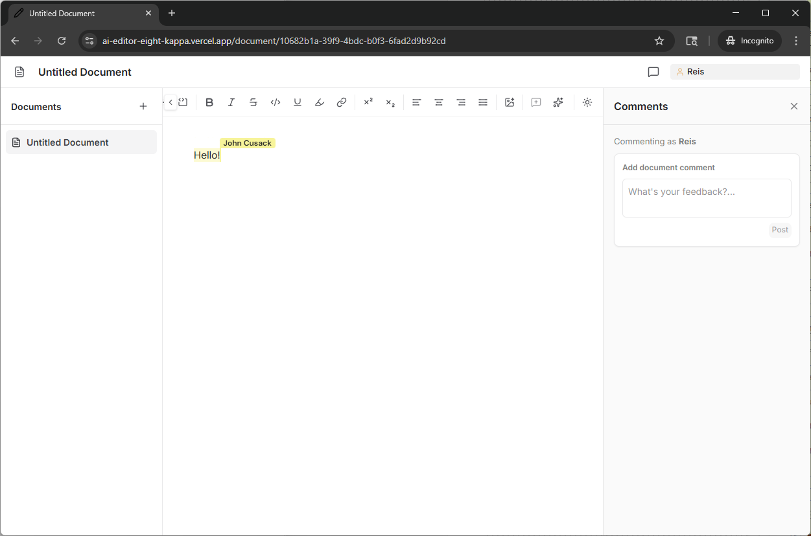
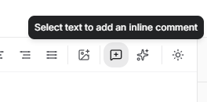
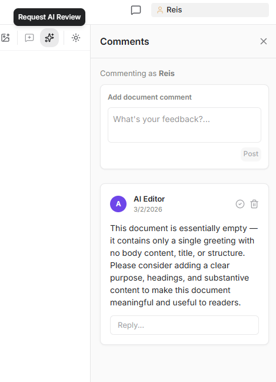
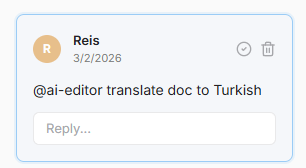

# AI Editor

A collaborative text editor powered by an LLM. Write documents together with other users and with the LLM as an AI co-author — getting inline suggestions, edits, and review comments in real time.

**Live demo:** [ai-editor-eight-kappa.vercel.app](https://ai-editor-eight-kappa.vercel.app/)



You can comment on the whole document or select text and click the "add inline comment" button in the toolbar:



You can also ask AI Editor to review the document and add comments:



To address the AI Editor you can use "@ai-editor":




## Features

- **Real-time collaboration** — multiple users can edit the same document simultaneously (powered by Yjs + Hocuspocus)
- **AI co-authorship** — the LLM participates as an author, responding to comments directed at it and making edits when given actionable feedback
- **Inline comments** — highlight text and leave comments (Google Docs style); the LLM can reply and act on them
- **AI review** — manually request a review from the LLM, or let it review changes as they come in
- **Highlight actions** — select text to trigger LLM actions like translation, coherence improvements, or reorganization
- **Document instructions** — give the LLM context and editorial guidelines per document
- **Multiple documents** — create and switch between documents with a flat file structure

## Tech stack

- [TanStack Start](https://tanstack.com/start) — full-stack React framework
- [Tiptap](https://tiptap.dev/) — rich text editor
- [Yjs](https://yjs.dev/) + [Hocuspocus](https://hocuspocus.dev/) — real-time collaboration
- [TanStack Query](https://tanstack.com/query) — data fetching
- [Vercel AI SDK](https://sdk.vercel.ai/) — AI streaming and tool use
- [PostgreSQL](https://www.postgresql.org/) — document and comment storage
- [Tailwind CSS](https://tailwindcss.com/) + [shadcn/ui](https://ui.shadcn.com/) — styling

## Running locally

### Prerequisites

- Node.js 18+
- A PostgreSQL database
- An [Anthropic API key](https://console.anthropic.com/)

### Setup

1. Clone the repo and install dependencies:

```bash
git clone https://github.com/your-username/ai-editor.git
cd ai-editor
npm install
```

2. Create a .env file and fill in your values:

Required environment variables:

```
DATABASE_URL=postgresql://...
ANTHROPIC_API_KEY=sk-ant-...
```

3. Start the development server:

```bash
npm run dev
```

The app will be available at `http://localhost:3000`.

## Building for production

```bash
npm run build
npm run start
```
